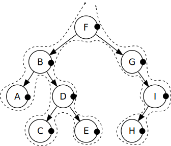

# WIDGZARD  




Widgzard is a simple module, which allows to build arbirary DOM tree through components with their own lifecycle.   

---

Widgzard is perfect if: 

- want to render arbitrary dom trees from literal objects and attach it somewhere. 

- each component needs to exploit his own and others component lifecycle

- all components can comunicate in a clear way

---

The _Widgzard_ aims to solve the problem in a clear way, receiving a main object literal containing all is needed to get whatever is needed really fast.  

As usual here is the due `hello world`:

```
<div id="trg"></div>
<script>
(function () {
	var trg = document.getElementById('trg'),
		W = getWidgzard();

	W.Widgzard.render({
		target: trg,
		content: [{
			text: "Hello world" 
		}]
	});
})();
</script>
```

.... to be continued